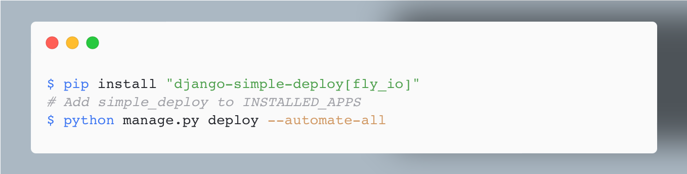

django-simple-deploy
===

This app gives you a management command that configures your project for an initial deployment. It targets Heroku at the moment, but could be expanded to target other platforms as well.

If you have a relatively simple Django project that runs locally, you can deploy your project in a few short steps. The only change you'll need to make to your project is to add this app to `INSTALLED_APPS`.



Prerequisites
---

If you haven't already done so, install the [Heroku CLI](https://devcenter.heroku.com/articles/heroku-cli) and make sure you're using [Git](https://git-scm.com) to track your project.

Make sure your project is running in a virtual environment, and you have either:

- Built a `requirements.txt` file with the command `pip freeze > requirements.txt`;
- Or, used Poetry to manage your project's requirements using a `pyproject.toml` file;
- Or, used Pipenv to create a `Pipfile`.

Quick start: using `--automate-all`
---

The `--automate-all` flag allows you to deploy your project in just three steps:
- Install `django-simple-deploy`.
    - With pip: `$ pip install django-simple-deploy`
    - With Poetry: `$ poetry add django-simple-deploy`
    - With Pipenv: `$ pipenv install django-simple-deploy`
- Add `simple_deploy` to `INSTALLED_APPS`;
- Run `python manage.py simple_deploy --automate-all`.

This will take care of creating a new Heroku app, configuring your project for deployment, committing all changes, pushing the project to Heroku's servers, running the initial migration, and opening the project in a new browser tab.

Quick start: using `requirements.txt`
---

If you've met the prerequisites, you can deploy your project using the following steps:

```
(venv)$ pip install django-simple-deploy
```

Now add `simple_deploy` to `INSTALLED_APPS`.

The following commands will deploy your project:

```
(venv)$ heroku create
(venv)$ python manage.py simple_deploy
(venv)$ git status                               # See what changes were made.
(venv)$ git add .
(venv)$ git commit -am "Configured project for deployment."
(venv)$ git push heroku main
(venv)$ heroku run python manage.py migrate
(venv)$ heroku open
```

After running this last command, you should see your project open in a browser. :)

Quick start: using Poetry
---

If you've met the prerequisites, you can deploy your project using the following steps:

```
(venv)$ poetry add django-simple-deploy
```

Now add `simple_deploy` to `INSTALLED_APPS`.

The following commands will deploy your project:

```
(venv)$ heroku create
(venv)$ python manage.py simple_deploy
(venv)$ git status                               # See what changes were made.
(venv)$ git add .
(venv)$ git commit -am "Configured project for deployment."
(venv)$ git push heroku main
(venv)$ heroku run python manage.py migrate
(venv)$ heroku open
```

After running this last command, you should see your project open in a browser. :)

Quick start: using Pipenv
---

If you've met the prerequisites, you can deploy your project using the following steps:

```
(venv)$ pipenv install django-simple-deploy
```

Now add `simple_deploy` to `INSTALLED_APPS`.

The following commands will deploy your project:

```
(venv)$ heroku create
(venv)$ python manage.py simple_deploy
(venv)$ git status                               # See what changes were made.
(venv)$ pipenv lock                              # Update new dependencies.
(venv)$ git add .
(venv)$ git commit -am "Configured project for deployment."
(venv)$ git push heroku main
(venv)$ heroku run python manage.py migrate
(venv)$ heroku open
```

After running this last command, you should see your project open in a browser. :)

Detailed steps
---

Since this project only focuses on Heroku at the moment, you'll need to make a [Heroku](https://heroku.com/) account and install the [Heroku CLI](https://devcenter.heroku.com/articles/heroku-cli). Heroku lets you deploy up to five projects for free. Projects that are deployed on a free account "go to sleep" when they're not being used, but there's plenty of uptime to practice the deployment process before you need to pay for hosting.

Heroku uses Git to manage the deployment process, so you'll need to install and use [Git](https://git-scm.com) for version control if you're not already doing so. It's beyond the scope of these instructions to provide an introduction to Git, but if you're not using version control yet you really should run through a basic tutorial before focusing on deployment. It's also a good idea to commit all of your own changes before starting this deployment process. That way you can easily go back to your non-deployment state if anything goes wrong, and you can also see the specific changes that are made in preparing for deployment.

Each Django project quickly ends up with its own set of specific dependencies. These include a specific version of Django, and any number of other libraries that you end up using in a project. These dependencies need to be managed separate from any other Django project you might have on your system, and separate from any other Python project you work on. There are a number of approaches to dependency management. If you're working in a virtual environment, you can generate a requirements file with the command `pip freeze > requirements.txt`. If you're using Poetry, a `pyproject.toml` file and a `poetry.lock` file were probably generated when you installed your dependencies. If you're using Pipenv, a `Pipfile` and `Pipfile.lock` were probably generated when you installed your dependencies.

For the deployment process, work in an active virtual environment in your project's root folder. You can install `django-simple-deploy` with Pip:

```
(venv)$ pip install django-simple-deploy
```

You can also install it with Poetry:

```
(venv)$ poetry add django-simple-deploy
```

You can also install it with Pipenv:

```
(venv)$ pipenv install django-simple-deploy
```

You'll need to add the app `simple_deploy` to `INSTALLED_APPS` in `settings.py`. This is a stripped-down app that makes the management command `manage.py simple_deploy` available in your project.

Now run:

```
(venv)$ heroku create
```

This creates an app for you on the Heroku platform. You'll get a URL for your project, such as `salty-river-90253.herokuapp.com`. Heroku will also establish a connection between your local project and the Heroku app.

The following commands will configure your project for deployment to Heroku. It's a good idea to run `git status` after configuring for deployment, so you can review the changes that were made to your project in preparing for deployment.

```
(venv)$ python manage.py simple_deploy
(venv)$ git status
(venv)$ git add .
(venv)$ git commit -am "Configured project for deployment."
```

If you're using Poetry, `manage.py simple_deploy` will generate a `requirements.txt` file for you, without affecting your local environment. It does this because Heroku doesn't recognize `pyproject.toml` or `poetry.lock`.

If you're using Pipenv, you'll need to regenerate your lock file after running `manage.py simple_deploy`. The `simple_deploy` command modifies your Pipfile, and if you try to push your project to Heroku without rebuilding the lock file it will complain about an out-of-date lock file. Your commands will look like this:

```
(venv)$ python manage.py simple_deploy
(venv)$ git status
(venv)$ pipenv lock
(venv)$ git add .
(venv)$ git commit -am "Configured project for deployment."
```

Now your project should be ready for deployment. To configure your project, `simple_deploy` does the following:

- Sets an environment variable on the Heroku server called `ON_HEROKU`, that lets the project detect when it's being run on the Heroku server. This allows us to have a section in `settings.py` that only applies to the deployed version of the project.
- Adds `django-simple-deploy` to your requirements file, if it's not already there.
- Generates a `Procfile`, telling Heroku what process to run. This is the production version of `manage.py runserver`.
- Adds `gunicorn`, `dj-database-url`, `psycopg2`, and `whitenoise` to your requirements file, if they're not already listed. These packages help serve the project in production, including managing the production database and serving static files efficiently.
- Makes sure the `ALLOWED_HOSTS` setting includes the URL that Heroku created for the project.
- Modifies `settings.py` to use the production database.
- Configures the project to use `whitenoise` to manage static files such as CSS and JavaScript files.

If you want to see the changes that were made, run `git status` and take a look at the files that were created or modified after running `manage.py simple_deploy`. Also, if you're curious to see the code that generates these changes, you can see the `simple_deploy.py` code [here](https://github.com/ehmatthes/django-simple-deploy/blob/main/simple_deploy/management/commands/simple_deploy.py).

The remaining commands will push your project to Heroku, set up the database on Heroku, and open your project in a browser:

```
(venv)$ git push heroku main
(venv)$ heroku run python manage.py migrate
(venv)$ heroku open
```

Heroku assumes you are pushing your project from a `main` or `master` branch. If you're pushing from any other branch, you'll need to run a command like `git push heroku test_branch:main`. This pushes your test branch to Heroku's main branch. See the section "Deploying from a branch besides main" on Heroku's [Deploying with Git](https://devcenter.heroku.com/articles/git#deploying-code) page.

Ongoing development
---

After your initial deployment, you shouldn't need to run the `simple_deploy` command again. If you make changes to your project and want to push them to Heroku, take the following steps:

- Commit your changes locally.
- Run `git push heroku main`.
- If you made any changes to the database, run `heroku run python manage.py migrate`.

There's a lot more to know about deployement, so see the [Heroku Python documentation](https://devcenter.heroku.com/categories/python-support) and start to get familiar with the parts of it that are relevant to your project.

If it doesn't work
----

If anything doesn't work, this project will try to tell you what to do in order to deploy successfully. If it doesn't work and you think it should, feel free to [open an issue](https://github.com/ehmatthes/django-simple-deploy/issues). If the deployment fails and you want to undo all of these changes, you should be able to check out your last commit before starting this process and pick up your deployment efforts from there. You can also uninstall this package with the command `pip uninstall django-simple-deploy`. If you do this, make sure to remove `simple_deploy` from `INSTALLED_APPS`.

Contributing
---

If you want to contribute to this project, feel free to [open an issue](https://github.com/ehmatthes/django-simple-deploy/issues) and share how you'd like to help.

A great way to get started is to clone the project and run the integration tests. See the current [testing documentation](integration_tests/README.md) to get started.

Good luck, and please be mindful
---

Web apps have been around for a while now, and many people take them for granted because we've seen so many silly projects. But the power of a web app has never been diminished; if you have an idea for a project and you know how to build an app, you can share your idea with the world and see if it goes anywhere.

Every project that gains traction has an impact on people's lives. Many have unintended consequences, and some of that can not be avoided. If your project is gaining traction, please be mindful of the positive and negative impact it can have on people, and do what's needed to make sure it's a net positive in the world. :)
